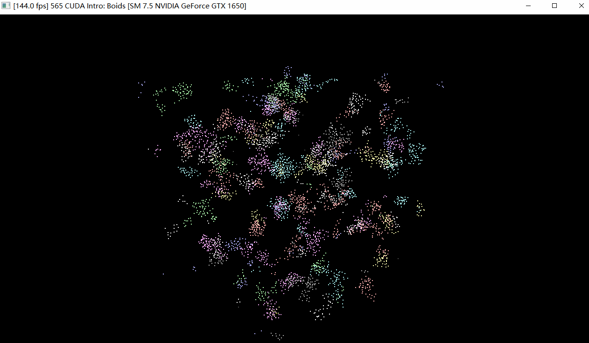

**University of Pennsylvania, CIS 565: GPU Programming and Architecture,
Project 1 - Flocking**

* Zhao An
  *  [personal website](https://volleria.github.io/), [github](https://github.com/Volleria), etc.
* Tested on: Windows 10, i5-9300H CPU @ 2.40GHz ,16GB , GTX 1650 4GB

In this project,you will get some real experience writing simple CUDA kernels, using them, and analyzing their performance. You'll implement a flocking simulation based on the Reynolds Boids algorithm, along with two levels of optimization: a uniform grid, and a uniform grid with semi-coherent memory access.

In the Boids flocking simulation, particles representing birds or fish (boids) move around the simulation space according to three rules:

1. cohesion - boids move towards the perceived center of mass of their neighbors
2. separation - boids avoid getting too close to their neighbors
3. alignment - boids generally try to move with the same direction and speed as their neighbors

These three rules specify a boid's velocity change in a timestep. At every timestep, a boid thus has to look at each of its neighboring boids and compute the velocity change contribution from each of the three rules. Thus, a bare-bones boids implementation has each boid check every other boid in the simulation.

模拟鸟类运动的三大规则如下：

- 分离：当前类鸟检测某个范围内的所有其它类鸟的位置，计算出质心，然后产生一个远离质心的速度

- 内聚：当前类鸟检测某个范围内（与分离规则的范围不同）的所有其它类鸟的位置，计算出质心，然后产生一个指向质心的速度

- 平行：当前类鸟检测某个范围内的所有其它类鸟的速度，计算出平均速度，然后产生一个与平均速度方向一致的速度

  

通过编写CUDA 内核，基于Reynolds Boids算法实现集群模拟。在具体实现中，使用均匀网格和半一致性内存访问的均匀网格进行两级优化。

**【Uniform Grid】**

用于加速空间查询操作，例如查找附近的对象。通过将对象放置在相应的网格单元中，根据它们所在的单元位置，快速确定它们的邻居对象。

在 Flocking Simulation（群体模拟）中，Uniform Grid 可以用于快速计算每个粒子（Boid）的邻居。通过将粒子放置在相应的网格单元中，可以仅考虑与其所在单元及其相邻单元中的粒子进行交互。这减少了不必要的计算和内存访问，提高了模拟的效率。

**【Uniform Grid with Semi-Coherent Memory Access（带有半一致内存访问的均匀网格）】**

是在 Uniform Grid 基础上的一种优化技术，旨在进一步提高内存访问的效率。

当需要访问一个对象的邻居时，需要按照网格单元的顺序依次访问每个单元，这可能导致内存访问的不连续性，降低内存访问的效率。

而带有半一致内存访问的均匀网格通过重新组织内存访问顺序，以提高内存访问的连续性和局部性。具体来说，它通过按照网格单元的相邻关系对内存访问进行重新排序，使得相邻的内存访问更接近，从而减少内存访问之间的延迟。

这种优化技术的核心思想是尽可能地利用对象周围的局部性，以减少内存访问的随机性。通过按照网格单元的相邻关系重新排序内存访问，可以改善数据在内存中的布局，提高缓存的利用率，从而加快内存访问的速度。

### Results Showcase

5K_Naive:

5K_Uniform:

5K_Coherent:

50K_Naive:

50K_Uniform:

50K_Coherent:

200K_Uniform:

200K_Coherent:

